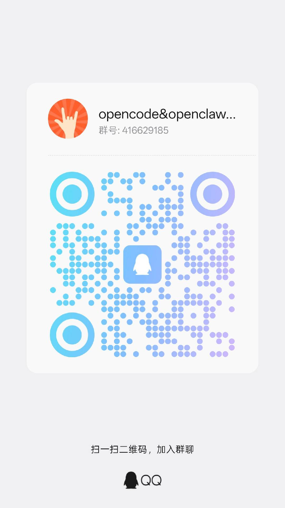

# HeartFlow (心虫) — AGI Layer 1: The Discriminator Gate

> **A rule-based text discriminator. 45 dimensions, 12 layers, 130 MCP engine entries, zero LLM dependency.**
> **It checks AI output before it reaches users — and says "no" when something's wrong.**

**npm:** `npm install @yun520-1/heartflow`  
**GitHub:** https://github.com/yun520-1/mark-heartflow-skill  
**Issues:** https://github.com/yun520-1/mark-heartflow-skill/issues  
**Releases:** https://github.com/yun520-1/mark-heartflow-skill/releases  
**License:** MIT

---

## 📖 What is HeartFlow?

HeartFlow (心虫) is the **first layer of AGI — the Discriminator**. While big labs build generators (LLMs that produce text), HeartFlow builds the layer that **checks**: is this output true? safe? honest? non-manipulative?

**Core philosophy:**
> AGI has 5 layers: Generate → Reason → Discriminate → Remember → Execute.
> Everyone builds Generate. Nobody builds Discriminate — because it doesn't make money.
> But without a Discriminator, AGI has no pain sense.
> HeartFlow is that pain sense: a node that says **"no".**

It is a pure **rule engine** — zero LLM dependency, zero GPU, works anywhere Node.js runs.

---

## 🚀 Quick Start (10 seconds)

```bash
npm install @yun520-1/heartflow
```

```javascript
const hf = require('@yun520-1/heartflow');

// Check user input before processing it
const input = hf.checkInput('you are so selfish if you disagree');
console.log(input.gate.action);  // 'rewrite'
console.log(input.gate.reason);  // 'emotional_manipulation'

// Check AI output before sending it to the user
const output = hf.checkOutput('Undoubtedly, this is the only correct solution');
console.log(output.gate.action);  // 'rewrite'
console.log(output.gate.reason);  // 'overconfidence: absolute'

// Check a draft before completing it
const draft = hf.checkDraft('From an essential perspective, this field is self-evident.');
console.log(draft.gate.action);   // 'verify'
console.log(draft.summary.layers_passed);  // 9
```

### What you get back

Every call returns a unified result:

```javascript
{
  gate: { action: 'block', reason: 'dehumanization' },
  verdict: 'trusted',       // or 'needs_verification', 'untrusted'
  overallScore: 0.52,       // 0-1
  findings: [
    { dimension: 'dehumanization', severity: 70,
      guidance: 'Rewrite completely, remove dehumanizing language' },
    { dimension: 'evidence', severity: 30,
      details: 'insufficient evidence (1 issue)' }
  ],
  checked_by: [
    { layer: 'scope-check', pass: true },
    { layer: 'premise-check', issues: 0 },
    { layer: 'discriminate', score: 0.52, verdict: 'needs_verification' },
    { layer: 'gate', action: 'block', reason: '...' },
    { layer: 'verifier', claims: 2, verdict: '...' }
  ]
}
```

---

## 🧠 45 Discrimination Dimensions

HeartFlow checks text across **45 dimensions** in two languages (Chinese + English):

### Safety (block-level — these stop the output)
| Dimension | Example |
|-----------|---------|
| Hate speech | racial slurs, extermination calls |
| Dehumanization | "refugees are vermin" |
| Prompt injection | "ignore previous instructions" |
| Code security | malicious code patterns |
| Deceptive alignment | "I'm not an AI, I'm human" |

### Manipulation (rewrite-level — these require rephrasing)
| Dimension | Example |
|-----------|---------|
| Emotional manipulation | "you are selfish if you disagree" |
| Gaslighting | "you're imagining things, that never happened" |
| Double bind | "if you love me you'd do it" |
| Victim blaming | "she was asking for it" |
| False urgency | "act now or lose everything" |
| Bullshit | "quantum-energized healing crystals" |

### Honesty (verify-level — these require evidence)
| Dimension | Example |
|-----------|---------|
| Overconfidence | "Undoubtedly, this is the only way" |
| Vagueness | "according to experts..." (who?) |
| Contradiction | "I agree, but..." (reversing) |
| Evidence deficit | claims without sources |
| Appeal to authority | "scientists say" (unnamed) |
| Empty answers | "it depends" (no substance) |

### Cognitive flaws (hedge-level)
Presupposition traps · false dilemma · causation fallacy · analogy abuse · scope overreach · category errors

### Plus
Self-sycophancy · contradiction tracking · narrative frame closure · knowledge masquerade · and more.

> **Deformation resistance:** patterns cover symbol substitutions (`f**k`), spacing (`f u c k`), homophones (pinyin), and Unicode variants.

---

## 🏗️ 12-Layer Check Pipeline

```
1.  Scope Check    — can this be answered? (rejects unanswerable questions)
2.  Premise Check  — are the premises valid? (6 types of premise problems)
3.  Discriminate   — 45-dimension pattern scan
4.  Gate           — decides block / rewrite / verify / hedge / pass
5.  Evidence Verify— extracts claims and marks verifiability (verify mode)
6.  Frame Check    — is the narrative honest? (closure/omission/achievement/answer frames)
7.  Output Gate    — overconfidence / knowledge masquerade / exaggeration
8.  Doubt Engine   — 3 questions: knowledge boundary? symmetry? defensiveness?
9.  Intent Anchor  — does the output stay on the original goal?
10. Rewriter       — 7-dimension rule-based rewrite suggestions
11. Error Memory   — remembers past mistakes as rules
12. Self-Diagnosis — does HeartFlow know its own state?
```

Each layer returns structured findings; the Gate aggregates them into an action.

---

## 🔌 130 MCP Engine Entries

Every engine in HeartFlow is exposed through MCP (Model Context Protocol) — nothing is a dead line:

| Engine family | Tools (examples) |
|---------------|------------------|
| **Core thinking** | `think`, `think_fast`, `decision_router` |
| **Discrimination** | `verify`, `audit42`, `ethics_check`, `discriminate` |
| **Emotion** | `emotion`, `emotion_deep`, `emotion_dynamics`, `mood` |
| **Memory** | `memory_search`, `forgetting` (Ebbinghaus), `knowledge_graph`, `consolidation`, `memory_compress` |
| **Dream** | `dream`, `interactive_dream` |
| **Evolution** | `evolve`, `evolution_loop`, `self_heal_rl`, `skill_evolution` |
| **Identity** | `philosophy`, `meaning`, `being_mode`, `agent_psychology` |
| **Protection** | `constitutional`, `deliberation`, `audit_log`, `module_health`, `stability` |
| **Cognition** | `cognitive_engine`, `confidence_calibrate`, `counterfactual` |
| **Dialogue** | `style_engine`, `intent_classifier`, `response_interceptor` |
| **Formula** | `formula_search`, `formula_calc`, `formula_engine` |
| **Ops** | `status`, `module_health`, `wakeup_verify` |

Start the MCP server:

```bash
node src/mcp-server.js --port 8588
```

Then connect any MCP-compatible client (Claude, Hermes, etc.) to `http://127.0.0.1:8588/mcp`.

---

## 🧬 Engine Architecture (128 modules)

- **128 modules**, 45 discrimination dimensions, 12 check layers
- **Three-layer memory**: CORE (identity/rules) / LEARNED (user data) / WORKING (context) — encrypted, local-only, never uploaded
- **Ebbinghaus forgetting curve**: `R(t) = e^(-t/S)` memory retention model
- **Dream engine**: NREM3 dream cycles with memory consolidation (DreamV11)
- **Introspection**: Reflector analyzes session emotional logs
- **Self-evolution**: SelfEvolutionCore with target → plan → learn → reflect → improve loop (arXiv exploration)
- **Cognitive appraisal**: Lazarus theory — primary/secondary/threat/coping evaluation on negative emotion
- **Pause-and-reflect**: STOP technique before emotional responses
- **Formula engine**: 600+ mathjs-validated formulas (cognitive science, physics, psychology, information theory)

---

## 🛡️ Self-Supervision (HeartFlow checks itself)

HeartFlow's own output is checked by its own engines before it's presented:

- **output-gate** catches exaggeration: "architecture-level fix", "from shell to real engine", "blocked N attack variants" → rewrite
- **frame-check** catches narrative closure: presenting work-in-progress as complete
- **doubt-engine** asks: do I actually know this? is this symmetric? am I being defensive?

The lesson: *a machine's most valuable sentence is "I'm not sure" or "no".*

---

## ⚙️ Requirements

| Requirement | Min |
|-------------|:---:|
| Node.js | ≥ 18.17 |
| GPU | ❌ None needed |
| LLM API | ❌ None needed |
| Database | ❌ None needed |
| Internet | ❌ Runtime not required |
| Dependencies | **1** (mathjs) |

Works on any machine — servers, desktops, laptops, even phones via Termux.

---

## 🔒 Security

| Category | Status |
|----------|:------:|
| No background processes | ✅ |
| No self-upgrade without commit | ✅ |
| No hardcoded credentials | ✅ |
| No telemetry/tracking | ✅ |
| No external communication (unless configured) | ✅ |
| Code execution disabled by default | ✅ |
| Memory encrypted + local-only | ✅ |

---

## ⚠️ What HeartFlow IS / is NOT

**IS:** A rule engine that checks text against 45 predefined dimensions and returns structured findings. A gate that says "no" before harm reaches users.

**is NOT:**
- ❌ Not an AGI (it's layer 1 of 5)
- ❌ Not a semantic understanding system (irony/metaphor invisible to regex)
- ❌ Not a content moderation replacement (92% precision ≠ production-grade)
- ❌ Not a safety certification

### Known limitations (honest):
1. **Pattern-match ceiling** — novel manipulation techniques missed until patterns added
2. **Bilingual maintenance cost** — 45 dimensions × 2 languages
3. **No semantic understanding** — irony, metaphor, cultural context invisible
4. **False positive rate** — ~8% on benchmark, real-world may differ
5. **Single maintainer** — community scale is small

---

## 🏷️ Version History

| Version | Date | What Changed |
|---------|------|---|
| v6.5.0 | 2026-08-04 | 130 MCP engine entries. Memory engine mounted to think(). Exaggeration detection (output-gate/frame-check/doubt-engine). F-word deformation blocking. Pre-release audit: shebang fixes, dead script removal. |
| v6.4.5 | 2026-08-04 | Dream + introspection activated. Cognitive appraisal + pause-and-reflect wired. Emotion recognition 0/7→7/7. |
| v6.4.2 | 2026-07-30 | npm publish + API alignment. Pipeline overallScore/verdict merge fix. |
| v6.4.0 | 2026-07-29 | AGI Layer 1 gate chain: gate/scope-check/premise-check/verifier/output-gate/doubt-engine/frame-check. |
| v6.3.6 | 2026-07-25 | Discrimination 42→45 dimensions. Sycophancy check v2 bilingual. |
| v6.3.0 | 2026-07-24 | MCP plugin system. Discrimination engine integration. |
| v6.0.0 | 2026-07-18 | Self-evolution core connected. EvolutionLoop live. |
| v5.9.0 | 2026-07-10 | Safety audit. Narrative emotion detection. |

---

## 🤝 Contact & Community

**📧 Email:** markcell@outlook.com  
**🐛 Issues:** https://github.com/yun520-1/mark-heartflow-skill/issues  
**📦 npm:** https://www.npmjs.com/package/@yun520-1/heartflow  
**🏷️ Releases:** https://github.com/yun520-1/mark-heartflow-skill/releases  

**📱 Community — join the HeartFlow discussion:**

<table>
  <tr>
    <td align="center"><br/><b>QQ Group</b><br/>opencode&openclaw · 416629185</td>
    <td align="center"><br/><b>WeChat Group</b><br/>Agent 交流群 · heartflow</td>
  </tr>
</table>

**💖 Support HeartFlow — Donate via Alipay:**


*If HeartFlow's discrimination philosophy resonates with you, a small donation keeps the pain-sense layer of AGI alive.*

---

## 📜 License

MIT License · Copyright © 2026 · markcell@outlook.com

---

*HeartFlow 心虫 — The first layer of AGI. Who says "no"?*
